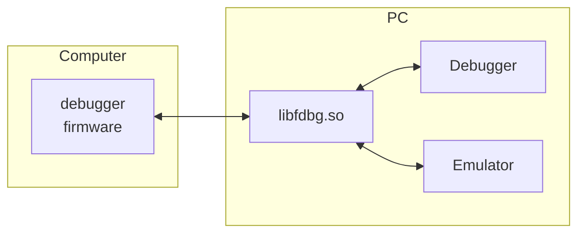

# fortuna-debugger
Fortuna Debugger is a set of 3 different tools that, toghether, provide debugging capability to any custom computer:

```mermaid
graph LR

  subgraph Computer
    fdbg[debugger\nfirmware]
  end

  subgraph PC
    libfdbg.so <--> Debugger
    libfdbg.so <--> Emulator
  end

  fdbg <--> libfdbg.so
```
